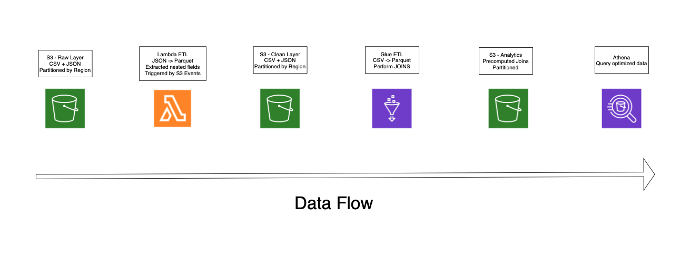

# Data Pipeline Youtube Analysis

End-to-end AWS data pipeline for processing and analyzing YouTube trending data

## Overview

Built a data pipeline on AWS to process and analyze YouTube trending data from multiple regions. The pipeline takes in CSV and JSON files, cleans and converts them into structured Parquet datasets, and stores them in a layered data lake (raw, clean, analytics). Using Lambda and Glue for data processing and Athena for querying, the project produces a final table that is easier and faster to query, reducing runtime by over 80% by partitioning data and avoiding repeated joins.

## Architecture 



1. Data Ingestion  
   - Uploaded raw CSV and JSON data to Amazon S3  
   - Organized data by region to enable partitioning  

2. Transformation (Lambda)  
   - Extracted nested fields from JSON data  
   - Converted semi-structured data into Parquet format  
   - Triggered automatically via S3 events  

3. ETL Processing (Glue)  
   - Transformed CSV data into Parquet using PySpark  
   - Standardized schemas and aligned data types  
   - Applied partitioning by region for efficient querying  

4. Analytics Layer  
   - Joined cleaned datasets into a final analytics table  
   - Stored as partitioned Parquet for performance optimization  

5. Querying & Visualization  
   - Queried data using Amazon Athena  
   - Built dashboards and insights using Amazon QuickSight  

## Tech Stack

1. Cloud Platform: AWS  
2. Storage: Amazon S3 (data lake: raw, clean, analytics layers)  
3. Data Processing: AWS Lambda, AWS Glue (PySpark)  
4. Query Engine: Amazon Athena  
5. Languages: Python, SQL  
6. Libraries: Pandas, awswrangler  
7. Data Formats: CSV, JSON, Parquet  

## Performance Optimization

- Reduced Athena query runtime from **8.547s to 1.416s (~83% improvement)**
- Eliminated repeated joins by materializing a final analytics table
- Partitioned data by region to reduce scanned data and improve query efficiency

## Repository Structure

```
├── lambda/ # Lambda transformation scripts (JSON → Parquet)
├── glue/ # AWS Glue ETL jobs (PySpark)
├── sql/ # Athena queries and analytics queries
├── architecture/ # Architecture diagram
├── sample_data/ # Sample dataset for reference/testing
├── README.md # Project overview
```

## Future Improvements

- Add workflow orchestration (e.g., Airflow)
- Support streaming ingestion (e.g., Kafka or Kinesis)
- Implement data quality validation checks

## Acknowledgment

This project was inspired by an end-to-end data engineering tutorial by Darshil Parmar on YouTube.  

The implementation in this repository was independently built and extended to reinforce understanding of AWS data pipelines, including data modeling, transformation, and performance optimization techniques.